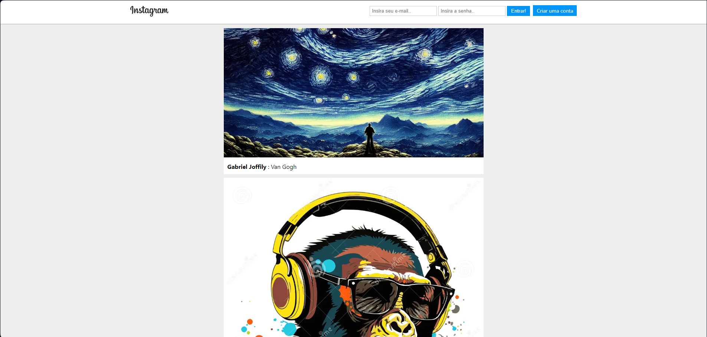

# 📱 Instagram Clone App

## 📝 Descrição

Este projeto é uma espécie de clone da rede social Instagram, disponibilizado no curso "JavaScript Completo - Danki Code". 
A ideia do projeto é treinar a lógica em JavaScript, juntamente com o React. Além disso, é utilizado o sistema do Firebase para realizar o back-end.
 
 
Você pode acessar o projeto através deste link: [Instagram Clone - Site](https://instagram-estudo.web.app).

## 🛠️ Tecnologias Utilizadas
<ul>
  <li>HTML5: Para a estrutura básica da aplicação;</li>
  <li>CSS3: Para o layout e estilização, com design responsivo;</li>
  <li>React: Para a construção da interface de usuário com componentes reutilizáveis;</li>
  <li>
    Firebase: Para o back-end, incluindo:
    <ul>
      <li>Firebase Auth: Autenticação de usuários (login/logout);</li>
      <li>Firebase Firestore: Armazenamento de dados de usuários e postagens;</li>
      <li>Firebase Storage: Armazenamento de imagens;</li>
      <li>Firebase Hosting: Hospedagem da aplicação.</li>
    </ul>
  </li>
</ul>

## ✨ Funcionalidades
<ul>
  <li>Autenticação de usuários: Registro e login com e-mail/senha via Firebase;</li>
  <li>Postagem de fotos: Usuários podem fazer upload de fotos que são armazenadas no Firebase Storage;</li>
  <li>Feed de postagens: Exibição de todas as postagens em ordem cronológica;</li>
  <li>Comentários em postagens: Usuários podem comentar nas fotos postadas;</li>
  <li>Design responsivo: Layout adaptável para diferentes tamanhos de tela (mobile, tablet e desktop).</li>
</ul>

## 📬 Contatos

Gostou do projeto? Gostaria de saber mais sobre mim? Entre em contato!

- 📧 Email: [gabrieljescudine@gmail.com](mailto:gabrieljescudine@gmail.com)
- 💼 LinkedIn: [Gabriel Joffily Escudine](https://www.linkedin.com/in/gabrieljoffilyescudine/)

## 📝 Licença
Este projeto foi desenvolvido com o propósito de aprendizado e é de código aberto. Ele não está associado ao Instagram ou Facebook e é disponibilizado sob a licença MIT.
